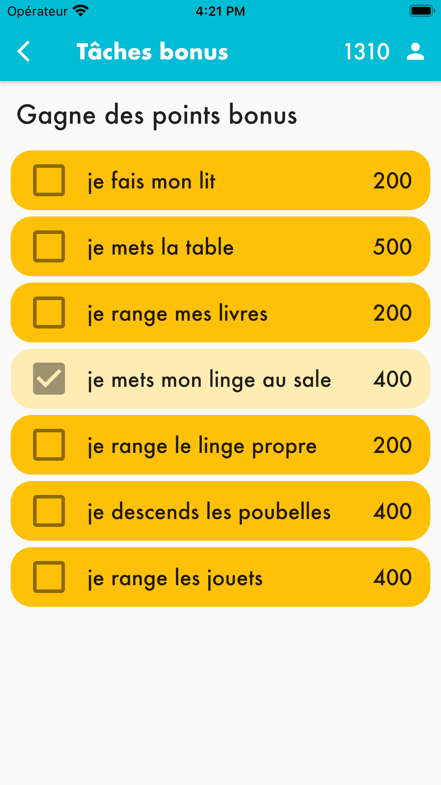
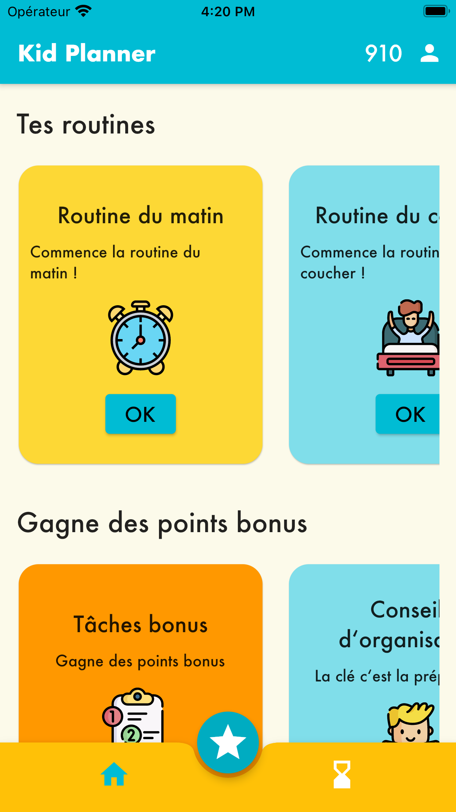

# project_kidplanner

To help kids organize:
A kid wins points when he/she does the routines or bonus tasks, the points can be used playing games.

- Programs for morning and bedtime Routines
- Bonus Tasks
- Advices for a good planning
- Task timer
- A game, only if the kid won enough points

2.06.21
- Internationalization in French done, language chosen in the device settings is used.
- null safety migration
- Add the possibility to create and edit routines and steps (ongoing)

Roadmap/Todolist:

- Be able to have more than one user on a device (currently the data is saved on the device, but only one user can be created)
- Introduce a task validation system with QR Code
- Internationalize (German, French)
- Animations
- Store the data on an external Datenbank and allow a parent/tutor to see the progress of the participants

Project developed as a Week Project after 3-weeks course Flutter/Dart.

   

   

